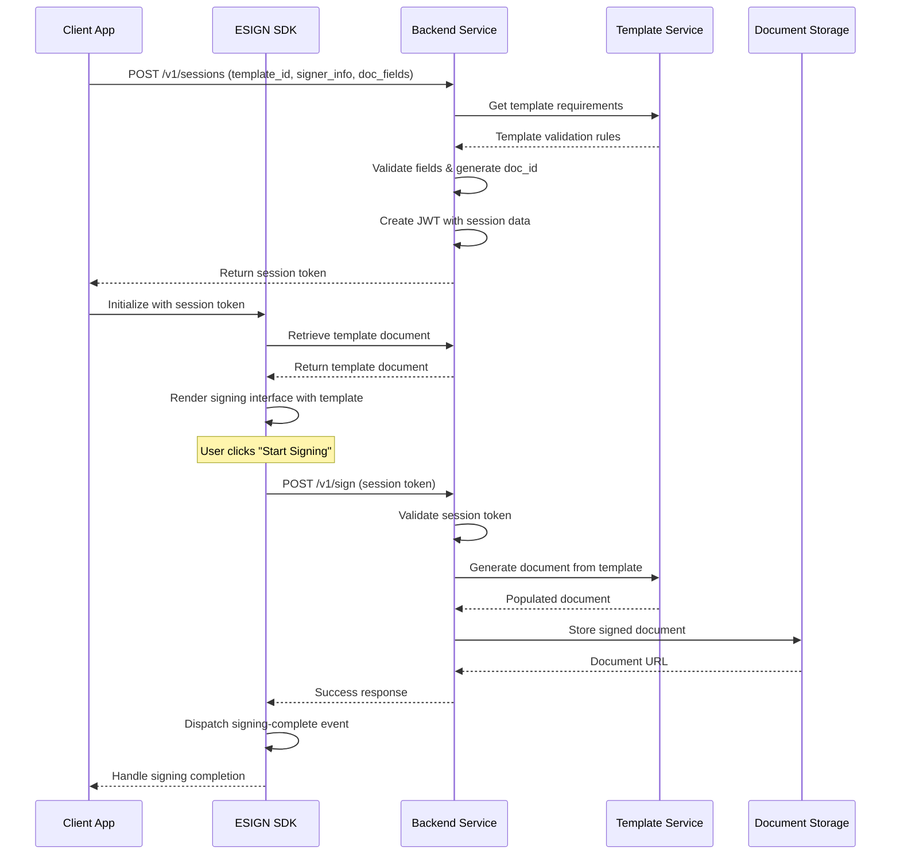

# ESIGN SDK

A lightweight JavaScript library that provides a custom web component `<esign-component>` for embedding ESIGN workflows into your web applications.

## Live Demo

Check out the [live demo](https://joinworth.github.io/esign-SDK/example.html)

## Features

- Simple integration with just a few lines of code.
- Customizable attributes for API key and document ID.
- Secure interaction with ESIGN APIs using API keys.
- Built-in UI for initiating signing workflows.
- Developer mode for testing and development

## How It Works

1. Developers include the ESIGN SDK in their application.
2. Add the `<esign-component>` web component to the HTML with `api-key` and `document-id` attributes.
3. The component interacts with your backend ESIGN API to trigger the signing process and provide status feedback.

## Implementation Guide

### Step 1: Include the ESIGN SDK

#### Option 1: CDN

```html
<script src="https://cdn.jsdelivr.net/gh/joinworth/esign-SDK@1.0.0/esign-sdk.js"></script>
```

### Step 2: Generate a Session Token

First, get a session token from the ESIGN API using your API key:

```bash
curl -X POST https://localhost:3000/api/v1/sessions \
  -H "Content-Type: application/json" \
  -H "Authorization: Bearer YOUR_API_KEY" \
  -d '{
    "templateId": "irs_8821",
    "signer": {
      "id": "user_123",
      "email": "john@example.com",
      "fullName": "John Smith",
      "title": "CEO"
    },
    "documentFields": {
      "legalName": "Acme Corp LLC",
      "addressLine1": "123 Main St",
      "addressLine2": "Suite 100",
      "city": "San Francisco",
      "state": "CA",
      "zip": "94105",
      "taxId": "12-3456789"
    }
  }'
```

Response:

```json
{
  "status": "success",
  "message": "Session created successfully",
  "data": {
    "sessionToken": "mock_wmi508",
    "expiresAt": "2025-01-24T22:59:59.492Z",
    "documentId": "doc_9m3dr9",
    "templateId": "template_123",
    "signer": {
      "id": "user_123",
      "email": "john@example.com",
      "fullName": "John Smith",
      "title": "CEO"
    },
    "documentFields": {
      "legalName": "Acme Corp LLC",
      "addressLine1": "123 Main St",
      "addressLine2": "Suite 100",
      "city": "San Francisco",
      "state": "CA",
      "zip": "94105",
      "taxId": "12-3456789"
    }
  }
}
```

The response includes a session token along with the complete session details including document and signer information. The session token expires after 24 hours.

### Step 3: Add the Web Component

```html
<!-- Basic Usage - All signer and document data is encoded in the session token -->
<esign-component
  session-token="your-jwt-token"
  service-url="https://your-domain.com/api/esign"
  dev-mode
></esign-component>
```

### Configuration

| Attribute     | Required | Default                  | Description                    |
| ------------- | -------- | ------------------------ | ------------------------------ |
| session-token | Yes      | -                        | JWT token from the session API |
| service-url   | No       | https://api.esign.com/v1 | Base URL for the signing API   |
| dev-mode      | No       | false                    | Enable development mode        |

### Security Considerations

- Always generate session tokens on the backend
- Never expose your API KEY in client-side code

### Developer Mode

When the `dev-mode` attribute is present, the SDK will:

- Display a "Dev Mode" indicator
- Mock the signing API calls
- Return simulated successful responses
- Log actions to the console

This is useful for:

- Development and testing
- UI integration work
- Demos and presentations

### Events

The component emits the following custom events:

| Event Name       | Detail                                   | Description                                  |
| ---------------- | ---------------------------------------- | -------------------------------------------- |
| signing-complete | `{ status, documentId, timestamp, ... }` | Fired when signing is completed successfully |
| signing-error    | `{ error }`                              | Fired when an error occurs during signing    |

Example usage:

```javascript
document
  .querySelector("esign-component")
  .addEventListener("signing-complete", (event) => {
    console.log("Signing completed:", event.detail);
    // Handle successful signing...
  });

document
  .querySelector("esign-component")
  .addEventListener("signing-error", (event) => {
    console.error("Signing error:", event.detail.error);
    // Handle error...
  });
```

### Flow Diagram



This diagram shows:

1. Initial session creation with document fields
2. SDK initialization and validation
3. User-triggered signing process
4. Document generation and storage
5. Event handling and completion
