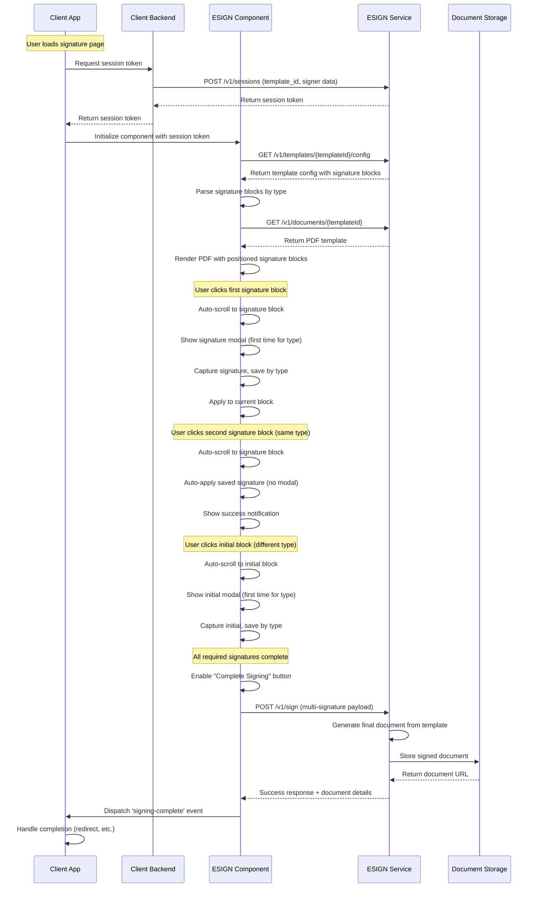

# ESIGN SDK - Developer Handoff Notes

## 1. Project Summary & Current State

### Overview

The ESIGN SDK is a JavaScript web component library that provides electronic signature capabilities for web applications. It offers a custom `<esign-component>` element that handles PDF document viewing, signature placement, and integration with backend ESIGN APIs with **full multi-signature support**.

### Current State of Progress

- ✅ **Core Web Component**: Fully implemented ESIGNComponent class with shadow DOM encapsulation
- ✅ **PDF Rendering**: Complete PDF.js integration with multi-page support, zoom controls, and navigation
- ✅ **Multi-Signature Workflow**: Advanced signature management with type-based handling (signature/initial)
- ✅ **Template Configuration API**: Dynamic signature placement via `/api/v1/templates/{templateId}/config`
- ✅ **Smart Modal Flow**: Show signature modal once per type, auto-apply for subsequent blocks
- ✅ **Auto-scroll & Visual Feedback**: Smooth navigation and highlight animations
- ✅ **Session Token System**: JWT-based authentication and authorization
- ✅ **Development Mode**: Comprehensive mock API responses for testing and development
- ✅ **Event System**: Custom events for signing-complete and signing-error
- ✅ **Example Implementation**: Working demo page with multiple use cases
- ✅ **CDN Distribution**: Ready for jsdelivr CDN deployment

### Development Status

**Phase**: Production Ready (v1.2.0)

- **Multi-signature functionality is complete and tested**
- Template-driven signature placement working
- Smart modal flow provides excellent UX
- Auto-scroll and visual feedback enhance usability
- Backward compatibility maintained
- Ready for production integration

## 2. Key Files & Architecture

### Core Files

- **`esign-sdk.js`** (1,547 lines) - Main web component implementation

  - ESIGNComponent class extending HTMLElement
  - PDF rendering and interaction logic
  - **Template configuration API integration**
  - **Multi-signature block management and completion tracking**
  - **Smart modal flow and auto-scroll system**
  - **Signature type management (signature/initial)**
  - API integration (real and mock modes)

- **`package.json`** - Project configuration and dependencies

  - Single dev dependency: live-server for local development
  - Main entry point: esign-sdk.js
  - Version: 1.0.0, ready for npm publishing

- **`example.html`** (324 lines) - Demo and testing interface

  - Multiple integration examples
  - Event handling demonstrations
  - Live testing interface with session token input
  - **Multi-signature workflow demonstrations**

- **`README.md`** - Comprehensive user documentation

  - API reference and integration guide
  - Session token creation examples
  - **Template configuration API documentation**
  - **Multi-signature API payload examples**
  - Security considerations
  - Flow diagrams and event specifications

- **`development.md`** - Developer handoff documentation

  - **Updated with multi-signature implementation details**
  - Architecture overview and technical specifications
  - Current state and next steps

- **`8821.pdf`** - Template document (IRS Form 8821)
  - Used for development and testing
  - Contains signature block positioning data
  - Serves as default document in dev mode

### Architecture Overview

```
┌─────────────────┐    ┌──────────────────┐    ┌─────────────────┐
│   Client App    │    │   ESIGN SDK      │    │  ESIGN Backend  │
│                 │    │                  │    │                 │
│ - HTML/JS       │◄──►│ - Web Component  │◄──►│ - Session API   │
│ - Event Handler │    │ - PDF Renderer   │    │ - Template API  │
│ - Session Token │    │ - Multi-Sig UI   │    │ - Document API  │
│                 │    │ - Smart Modals   │    │ - Storage       │
└─────────────────┘    └──────────────────┘    └─────────────────┘
```

## 3. Multi-Signature Workflow Sequence Diagram



## 4. Important Technical Notes

### Template Configuration System

- **API Endpoint**: `GET /v1/templates/{templateId}/config`
- **Response Format**: Contains signature blocks with positioning, types, and requirements
- **Signature Types**: "signature" and "initial" types supported
- **Dynamic Positioning**: X,Y coordinates as percentages with width/height dimensions
- **Backward Compatibility**: Falls back to session token signature blocks if template config fails

### Multi-Signature Management

- **Type-based Storage**: `capturedSignaturesByType` Map stores signatures by type
- **Status Tracking**: `signatureTypeStatus` Map tracks modal display and capture state
- **Smart Modal Flow**: Shows modal once per signature type, auto-applies for subsequent blocks
- **Bulk Application**: "Apply to all" option for multiple blocks of same type
- **Progress Tracking**: Real-time completion status with progress bar

### Auto-scroll & Visual Feedback

- **Smooth Scrolling**: Animated scroll to signature blocks with cubic easing
- **Highlight Animation**: Pulse effect when signature blocks are clicked
- **Success Notifications**: Toast notifications for auto-applied signatures
- **Visual Indicators**: Hover tooltips showing auto-applied signature status

### PDF Rendering Engine

- **Library**: PDF.js v3.11.174 via CDN
- **Worker**: Uses dedicated worker for performance
- **Canvas Rendering**: Each page rendered to HTML5 canvas
- **Zoom Levels**: [0.5, 0.75, 1, 1.25, 1.5, 2] with smooth transitions
- **Panning**: Click-and-drag navigation for large documents

### Multi-Signature API Integration

- **Enhanced Payload**: Supports multiple signatures in single API call
- **Signature Structure**: Each signature includes image, position, type, and ID
- **Mock Generation**: `generateMockSignatureImage()` creates base64 signature images for dev mode
- **Type Validation**: Ensures all required signatures are completed before submission

### Event System

- **signing-complete**: Fires with status, documentId, timestamp, and all signatures
- **signing-error**: Fires with error details for debugging
- **Custom Events**: Uses native CustomEvent API for framework compatibility
- **Enhanced Detail**: Event payload includes signature count and type information

### Development Mode Features

- **Mock Template Config**: Realistic multi-signature template configuration
- **Visual Indicators**: Yellow "Dev Mode" badge and enhanced logging
- **Signature Generation**: Mock base64 signature image creation
- **Type Testing**: Both signature and initial blocks for comprehensive testing

## 5. Next Steps

### Immediate Priorities

1. **Production Backend Testing**: Test template configuration and multi-signature APIs with real backend

   - Validate template config API response format
   - Test multi-signature payload submission
   - Verify signature image processing

2. **Performance Optimization**:

   - Large document handling with many signature blocks
   - Memory management for signature image storage
   - Optimize auto-scroll animations for mobile

3. **Error Handling Enhancement**:
   - Template config API failure scenarios
   - Invalid signature block configurations
   - Network failure recovery during multi-signature submission

### Future Enhancements

4. **Extended Signature Types**: Beyond signature and initial

   - Date fields with auto-population
   - Text input fields for custom data
   - Checkbox and radio button support
   - Numeric input validation

5. **Mobile & Touch Optimization**:

   - Touch-friendly signature capture canvas
   - Responsive signature block sizing
   - Gesture-based navigation improvements
   - Mobile-optimized modal layouts

6. **Advanced UX Features**:
   - Signature preview before application
   - Undo/redo signature functionality
   - Batch signature operations
   - Custom signature styling options

### Integration & Distribution

7. **Framework Integration Examples**:

   - React component wrapper with TypeScript
   - Vue.js integration guide
   - Angular directive implementation
   - SSR compatibility testing

8. **Security & Compliance**:
   - Digital signature standards compliance
   - Audit trail for signature events
   - Enhanced session token security
   - CSP compliance verification

### Documentation & Testing

9. **Comprehensive Testing Suite**:

   - Unit tests for multi-signature logic
   - Integration tests for template API
   - E2E tests for complete signature workflows
   - Performance benchmarks

10. **Enhanced Documentation**:
    - Interactive API documentation
    - Multi-signature implementation guides
    - Video tutorials for complex workflows
    - Migration guide from single to multi-signature
