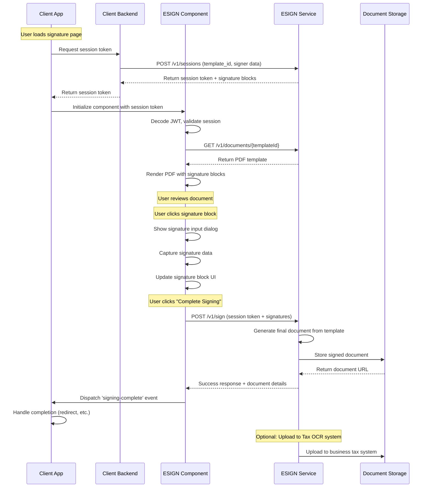

# ESIGN SDK - Developer Handoff Notes

## 1. Project Summary & Current State

### Overview

The ESIGN SDK is a JavaScript web component library that provides electronic signature capabilities for web applications. It offers a custom `<esign-component>` element that handles PDF document viewing, signature placement, and integration with backend ESIGN APIs.

### Current State of Progress

- ✅ **Core Web Component**: Fully implemented ESIGNComponent class with shadow DOM encapsulation
- ✅ **PDF Rendering**: Complete PDF.js integration with multi-page support, zoom controls, and navigation
- ✅ **Signature Workflow**: Interactive signature blocks with click-to-sign functionality
- ✅ **Session Token System**: JWT-based authentication and authorization
- ✅ **Development Mode**: Mock API responses for testing and development
- ✅ **Event System**: Custom events for signing-complete and signing-error
- ✅ **Example Implementation**: Working demo page with multiple use cases
- ✅ **CDN Distribution**: Ready for jsdelivr CDN deployment

### Development Status

**Phase**: Production Ready (v1.0.0)

- Core functionality is complete and tested
- Developer documentation is comprehensive
- Example implementation demonstrates all features
- Ready for integration into client applications

## 2. Key Files & Architecture

### Core Files

- **`esign-sdk.js`** (1,327 lines) - Main web component implementation

  - ESIGNComponent class extending HTMLElement
  - PDF rendering and interaction logic
  - Session token handling and validation
  - Signature block management and completion tracking
  - API integration (real and mock modes)

- **`package.json`** - Project configuration and dependencies

  - Single dev dependency: live-server for local development
  - Main entry point: esign-sdk.js
  - Version: 1.0.0, ready for npm publishing

- **`example.html`** (324 lines) - Demo and testing interface

  - Multiple integration examples
  - Event handling demonstrations
  - Live testing interface with session token input
  - Developer documentation examples

- **`README.md`** - Comprehensive user documentation

  - API reference and integration guide
  - Session token creation examples
  - Security considerations
  - Flow diagrams and event specifications

- **`8821.pdf`** - Template document (IRS Form 8821)
  - Used for development and testing
  - Contains signature block positioning data
  - Serves as default document in dev mode

### Architecture Overview

```
┌─────────────────┐    ┌──────────────────┐    ┌─────────────────┐
│   Client App    │    │   ESIGN SDK      │    │  ESIGN Backend  │
│                 │    │                  │    │                 │
│ - HTML/JS       │◄──►│ - Web Component  │◄──►│ - Session API   │
│ - Event Handler │    │ - PDF Renderer   │    │ - Document API  │
│ - Session Token │    │ - Signature UI   │    │ - Storage       │
└─────────────────┘    └──────────────────┘    └─────────────────┘
```

## 3. Signature Workflow Sequence Diagram



## 4. Important Technical Notes

### Session Token Structure

- **JWT Format**: Contains templateId, signer info, documentFields, signatureBlocks
- **Security**: Never expose API keys in client-side code
- **Expiration**: Tokens include expiration timestamp for session management
- **Dev Mode**: Provides default values when session decoding fails

### PDF Rendering Engine

- **Library**: PDF.js v3.11.174 via CDN
- **Worker**: Uses dedicated worker for performance
- **Canvas Rendering**: Each page rendered to HTML5 canvas
- **Zoom Levels**: [0.5, 0.75, 1, 1.25, 1.5, 2] with smooth transitions
- **Panning**: Click-and-drag navigation for large documents

### Signature Block System

- **Positioning**: X,Y coordinates as percentages of page dimensions
- **Types**: Currently supports 'signature' type, extensible for initials/dates
- **Status Tracking**: Uses Set data structures for completion state
- **Validation**: Ensures all required signatures are completed

### Event System

- **signing-complete**: Fires with status, documentId, timestamp, signatures
- **signing-error**: Fires with error details for debugging
- **Custom Events**: Uses native CustomEvent API for framework compatibility

### Development Mode Features

- **Mock Responses**: Simulates API calls without backend
- **Visual Indicator**: Yellow "Dev Mode" badge
- **Console Logging**: Detailed action logging for debugging
- **Flexible Validation**: Accepts invalid/missing session tokens

## 5. Next Steps

### Immediate Priorities

1. **Testing Suite**: Add unit tests for core functionality

   - Session token validation
   - PDF rendering edge cases
   - Signature completion logic
   - Event emission scenarios

2. **Error Handling**: Improve error boundary handling

   - Network failure recovery
   - Invalid PDF format handling
   - Session token expiration management

3. **Performance Optimization**:
   - Lazy load PDF.js only when needed
   - Implement virtual scrolling for large documents
   - Add signature block caching

### Future Enhancements

4. **Multi-signature Types**: Extend beyond basic signatures

   - Date fields with auto-population
   - Initial blocks for document changes
   - Text fields for custom input
   - Checkbox/radio button support

5. **Mobile Optimization**:

   - Touch-friendly signature capture
   - Responsive layout improvements
   - Gesture-based navigation

6. **Accessibility**:
   - ARIA labels for screen readers
   - Keyboard navigation support
   - High contrast mode support

### Integration Considerations

7. **Framework Compatibility**: Test with popular frameworks

   - React/Vue/Angular integration examples
   - SSR compatibility verification
   - TypeScript definitions

8. **Security Enhancements**:
   - Content Security Policy compliance
   - XSS prevention measures
   - Session token refresh handling

### Documentation & Distribution

9. **API Documentation**: Generate JSDoc documentation
10. **NPM Publishing**: Prepare for package registry distribution
11. **Integration Examples**: Create framework-specific examples
12. **Performance Benchmarks**: Document loading times and memory usage
